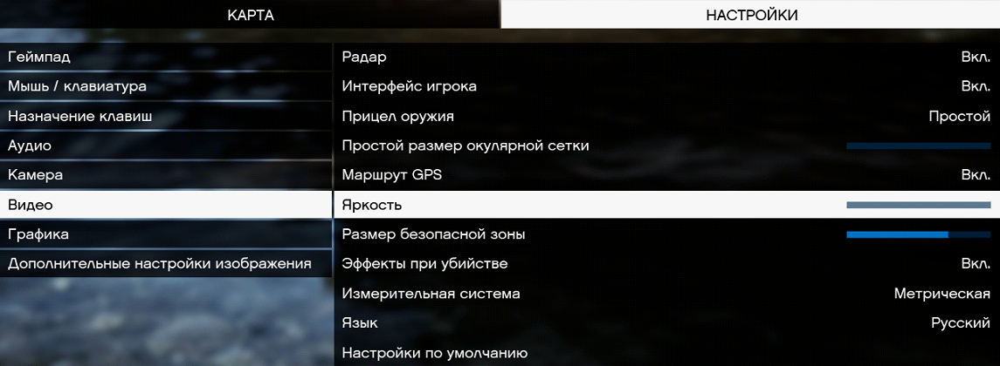
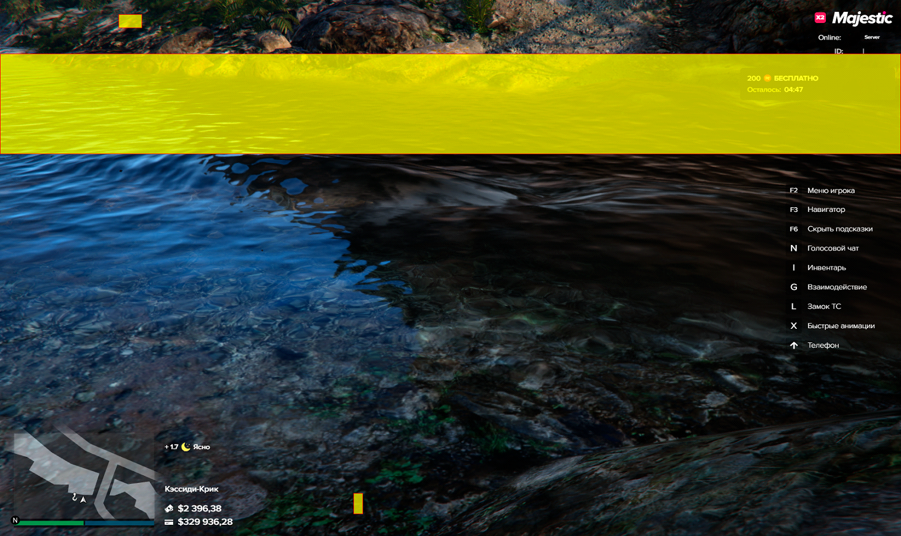

Спасибо за выбор AutoFishBot от PaulTwelve

Важная информация

⦁ Перед использованием распакуйте в удобное место.

⦁ Пожалуйста не переименовывайте скрипт.

⦁ Если скрипт не работает, отключите антивирус и заново его скачайте.

⦁ Бот написан на языке AutoHotkey, языке скриптов, а это значит что он не изменяет игру, не детектится анти-читами и не может быть забанен, а также в нём есть случайные задержки, поэтому вы можете спокойно им пользоваться и не ботяться бана или что кто-то вас заподозрит.

Подготовительные настройки

В настройках GTA (esc):

⦁ Видео

«Яркость» - «0» 

⦁ Графика

«Тип экрана» - «Оконный без рамки»

(Для работы функций наложения)

«Разрешение» - «1920 x 1080»

«Формат» - «Автоматически»

«Качество отражений» - «Высокая» (или выше)

«Эффект глубины резкости» - «Выкл.»

Использование

Поставить камеру чтобы речка попадала в поле поиска и убедиться что остальные поля не будут перегораживаться другими программами. (например уведомления Discord)

Место рыбалки

Скрипт может работать на 4-ёх показанных крючках:

Крючки

Инструкция по использованию

Запускаем скрипт AutoFishBot.exe
Задаём клавиши и нажимаем «Сохранить»
Встаём в зону закидывания удочки
Нажимаем на назначенную кнопку «Вкл/Выкл»

Дополнительная информация о скрипте

⦁ После переполнения инвентаря, ошибке или окончания наживки - скрипт автоматически остановится.

⦁ Рыбачя от 1-ого лица, при наличии очков - их нужно снять.

⦁ Скрипт активно обновляется, добавляются новые функции и улучшается пользовательский интерфейс для улучшения опыта его использования. Обновляется автоматически.

⦁ Иногда админы могут прилететь на рыбалку и спросить сдесь ли вы. Лучше бы вам в это время быть у компьютера чтобы показать что вы живы.

Реквизиты

GitHub: https://github.com/PaulTwelve/AutoFishBot-MajesticRP

Telegram: https://t.me/AutoFishBotMajesticRP
